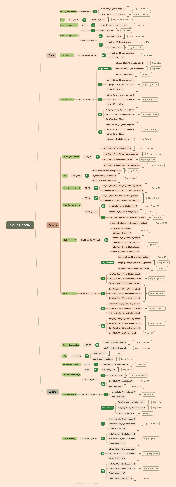

# LipidTrend Manuscript – Source Code and Data
This repository contains all source code and processed data required to 
reproduce the figures and supplementary results presented in:

**LipidTrend: A Structure-Aware Framework for Detecting Continuous Trends in Lipidomic Remodeling**

## Overview 
LipidTrend is a structure-aware statistical framework for detecting continuous 
lipidomic remodeling in chain-length × double-bond structural space.

This repository provides:  
* All R scripts used to generate main and supplementary figures  
* Processed input data (as described in the manuscript)  
* A fully locked computational environment via renv  

No new datasets were generated in this study. All lipidomics datasets were 
obtained from previously published studies as detailed in the manuscript.

## Software Environment
All analyses were performed under:  
* R 4.5.2  
* LipidTrend (Bioconductor release version used in manuscript)  
* Additional packages recorded in renv.lock  
  
To reproduce the computational environment:
```R
install.packages("renv")
renv::restore()
```
  
This restores all package versions exactly as used for figure generation.
  
If `renv` restoration fails due to R version mismatch, users may install 
required packages manually according to `renv.lock`.

## Reproducing the Figures
To reproduce a specific figure:
```R
source("scripts/[dataset]/[comparison]/[lipid class]/[chain_dimension_*.R]")
```
  
All scripts:  
* Load data from `data/`  
* Perform structure-aware smoothing and permutation testing  
* Apply BH-FDR correction  
* Save figures and tables to `results/`  

## Methodological Notes
Each analysis follows the workflow described in the manuscript:  
1. Species-level statistical testing.  
2. Signed log-transformed regional scoring.  
3. Gaussian kernel smoothing in structural space.  
4. Permutation-based null estimation.  
5. Benjamini–Hochberg FDR control.   
6. Significant zone identification (FDR < 0.05).  
  
Supported analysis modes demonstrated in this repository:  
* One-dimensional (chain length or unsaturation)  
* Two-dimensional (chain length × double bonds)  
* Abundance-weighted and unweighted smoothing  
* Odd–even chain stratification  

## Data Sources
All datasets analyzed in this study were obtained from previously published work
and are described in the manuscript and Supplementary Table 1.
  
No raw data redistribution beyond published material is included.

## Code Availability
The LipidTrend R package is publicly available:  
* Bioconductor: [https://bioconductor.org/packages/LipidTrend](https://bioconductor.org/packages/LipidTrend)  
* GitHub: [https://github.com/BioinfOMICS/LipidTrend](https://github.com/BioinfOMICS/LipidTrend)  

This repository specifically documents the exact scripts and processed inputs 
used to generate the figures in the manuscript.
  
## Repository Structure
The diagram below summarizes the relationship between datasets, analysis modules, 
and manuscript figures.



